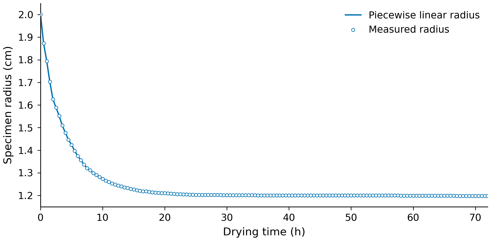
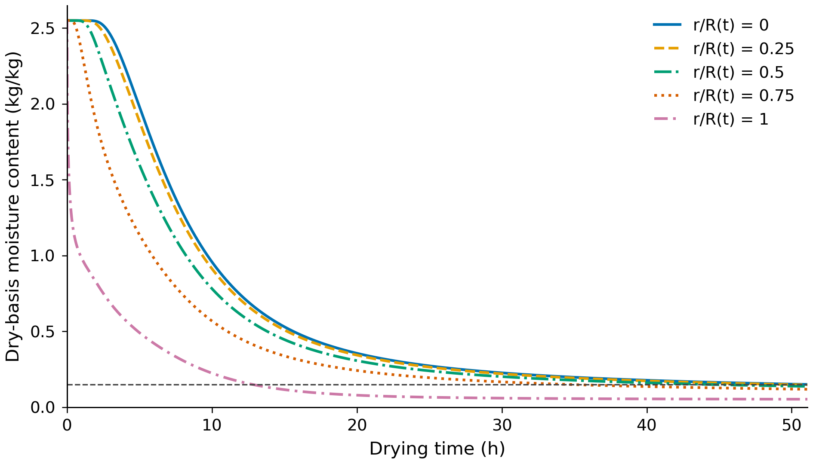
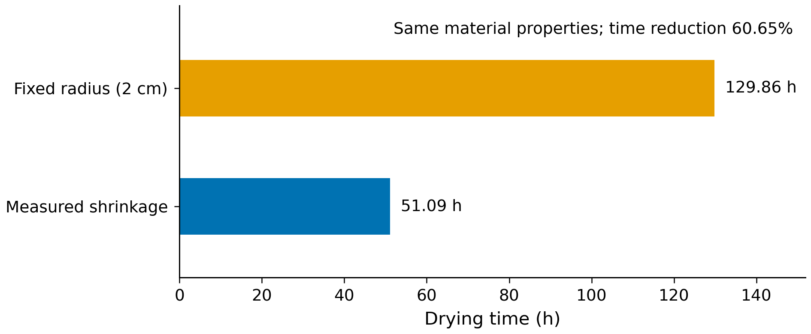

# 考虑尺寸收缩的烘干模型与时长预测

## 问题分析与半径变化

药材失水后，水分从内部迁移到表面的距离也随之缩短。第四问给出了烘干过程中的半径测量值，并更新了材料物性关系，需要据此重新计算温度场、含水率场和烘干终点。由于几何与物性从初期就发生变化，本问从原始均匀状态开始计算，取初始温度为$28\,^{\circ}\mathrm C$、干基含水率为$2.55\ \mathrm{kg/kg}$。

题目给出的145个半径数据点覆盖0至72 h。图1显示，半径在前期下降较快，由初始2.000 cm降至6 h时的1.374 cm，此后逐渐接近1.2 cm。测量时刻之间采用分段线性插值：

$$
R(t)=R_j+\frac{t-t_j}{t_{j+1}-t_j}(R_{j+1}-R_j),\qquad t_j\leq t\leq t_{j+1}.
\tag{4.1}
$$

式（4.1）直接保留了测量节点，求解时统一将半径换算为米。

图1：药材半径测量值及分段线性插值。圆点表示题目给出的测量数据，实线表示计算中采用的半径函数。

半径数据只描述外表面的运动，不能直接确定内部各层如何移动。为保留前问的一维径向框架，假设药材中段沿径向等比例收缩，长度保持不变，且各材料层的干物质量不变。引入相对半径

$$
\xi=\frac{r}{R(t)},\qquad 0\leq\xi\leq1,
 \qquad v_r=\frac{\dot R(t)}{R(t)}r.
\tag{4.2}
$$

固定的$\xi$对应同一材料层，其实际半径随$R(t)$变化。这样可以在固定的$[0,1]$区间内求解，避免每次收缩后重新划分材料层。

## 随材料运动的热质传递方程

干基含水率$C$表示水质量与干物质量之比。收缩改变材料体积，但如果一层材料没有与外部交换水分，其$C$应保持不变。因此，水分方程以随材料运动的干物质为基准建立。

记$\rho_d$为单位当前体积中的干物质量，假设初始干物质分布均匀。径向等比例收缩时，$\rho_d(t)=\rho_{d0}R_0^2/R(t)^2$在空间上仍均匀。取相对于材料的有效水分通量为$\boldsymbol j_w=-\rho_dD\nabla C$，由干物质与水分平衡得到

$$
\rho_d\frac{\mathrm D C}{\mathrm Dt}
 =\nabla\cdot(\rho_dD\nabla C).
\tag{4.3}
$$

约去空间均匀的$\rho_d$，并利用固定$\xi$处的时间变化即材料导数，得到

$$
\left.\frac{\partial C}{\partial t}\right|_{\xi}
 =\frac{1}{R(t)^2\xi}\frac{\partial}{\partial\xi}
 \left(\xi D(C,T_K)\frac{\partial C}{\partial\xi}\right).
\tag{4.4}
$$

式（4.4）已经包含材料运动的影响，不再重复加入收缩对流项。沿用前问的有效物性温度模型，则有

$$
\rho(C)c_p(C)\left.\frac{\partial T}{\partial t}\right|_{\xi}
 =\frac{1}{R(t)^2\xi}\frac{\partial}{\partial\xi}
 \left(\xi k(C)\frac{\partial T}{\partial\xi}\right).
\tag{4.5}
$$

其中，题目给出的物性关系为

$$
\begin{aligned}
 \rho(C)&=760+90C, & c_p(C)&=1850+2150\frac{C}{1+C},\\
 k(C)&=0.12+0.20\frac{C}{1+C},&
 D(C,T_K)&=4.2\times10^{-4}\exp\!\left(-\frac{0.30}{C}-\frac{3850}{T_K}\right).
 \end{aligned}
\tag{4.6}
$$

各物性采用国际单位制，$T_K=T+273.15$为材料局部绝对温度。这里的$\rho(C)$用于计算有效蓄热能力，与守恒推导中的干物质体积密度$\rho_d$作用不同。温度方程未另行闭合相变潜热、迁移携热和收缩功，因而只作为与题给物性相配套的工程近似。

轴线满足对称条件，表面通过换热和传质与烘房交换：

$$
\begin{gathered}
 T_{\xi}(0,t)=C_{\xi}(0,t)=0,\\
 -\frac{k_s}{R(t)}T_{\xi}(1,t)=h_T(T_s-T_\infty),\qquad
 -\frac{D_s}{R(t)}C_{\xi}(1,t)=h_m(C_s-C_\infty).
 \end{gathered}
\tag{4.7}
$$

换热与传质系数沿用$h_T=25\ \mathrm{W/(m^2\cdot K)}$和$h_m=8\times10^{-7}\ \mathrm{m/s}$。前4 h的烘房温度、等效外界水分浓度由题给数据线性插值；4 h以后沿用最后1 h共61个节点的均值，分别取$49.99893443\,^{\circ}\mathrm C$和$0.0499875410\ \mathrm{kg/kg}$。后期环境保持稳定属于计算假设。

## 移动网格离散与终点判定

在$\xi$方向划分$N$个等宽环层，令$\Delta\xi=1/N$。单元中心为$\xi_i=(i-1/2)\Delta\xi$，两侧界面为$\xi_{i\pm1/2}$，固定环形权重为

$$
w_i=\frac{\xi_{i+1/2}^2-\xi_{i-1/2}^2}{2},\qquad i=1,\ldots,N.
\tag{4.8}
$$

采用后向欧拉格式，对内部单元的水分方程离散得

$$
\begin{aligned}
 w_i\frac{C_i^{n+1}-C_i^n}{\Delta t}
 =\frac{1}{(R^{n+1})^2\Delta\xi}\bigl[&
 \xi_{i+1/2}D_{i+1/2}^{n+1}(C_{i+1}^{n+1}-C_i^{n+1})\\
 &-\xi_{i-1/2}D_{i-1/2}^{n+1}(C_i^{n+1}-C_{i-1}^{n+1})\bigr].
 \end{aligned}
\tag{4.9}
$$

固定权重对应固定的材料干物质量比例。若表面不交换水分，各单元通量相互抵消，$\sum_iw_iC_i$保持不变；均匀含水率也不会因网格收缩而升高。温度方程按相同通量形式组装，储存项增加当前时间层的$\rho c_p$。

内部界面物性取相邻单元的调和平均。令$\delta r=R^{n+1}/(2N)$，表示新时刻表面到最外层单元中心的距离。将半单元扩散阻力与表面交换阻力串联，得到向外通量及真实表面值：

$$
\begin{aligned}
 f_m&=\frac{C_N-C_\infty}{\delta r/D_s+1/h_m},&
 C_s&=C_\infty+\frac{f_m}{h_m},\\
 q_T&=\frac{T_N-T_\infty}{\delta r/k_s+1/h_T},&
 T_s&=T_\infty+\frac{q_T}{h_T}.
 \end{aligned}
\tag{4.10}
$$

式（4.10）各量均在新时间层迭代更新，$f_m$是约去$\rho_d$后的水分通量。每步交替更新温度、含水率及其物性，直至单元与表面状态的最大变化小于$10^{-10}$。最终采用$N=1600$，前3 h步长为0.0625 s，此后为0.5 s。

烘干结束要求药材各处均达标，故采用

$$
C_{\max}(t)=\max_{0\leq\xi\leq1}C(\xi,t),\qquad C_{\max}(t)<0.15.
\tag{4.11}
$$

每步检查全部单元、轴线重构值与真实表面值。首次跨越阈值后，从该步前一状态出发进行子步二分，将交点区间缩小到0.001 s以内，再将上界对应的小时数向上取至四位小数，重新计算该报告时刻，以保证未舍入结果严格低于阈值。

## 烘干时长与水分分布

在上述模型与环境假设下，考虑实测收缩后的烘干时长为

$$
\boxed{t_{\mathrm{dry}}=51.0945\ \mathrm h.}
\tag{4.12}
$$

该时刻的全域最大干基含水率为$0.1499999871\ \mathrm{kg/kg}$，位于轴线，说明本次计算中中心最后达到要求。药材半径为1.200 cm，结束时刻仍在半径测量数据范围内，无需外推72 h以后的尺寸。

表6给出每隔6 h及烘干结束时刻的含水率。这些时刻的半径均已小于1.5 cm，因此表中保留0、0.5、1 cm和当前表面。最后一行中心值显示为0.1500，是四位小数舍入的结果；达标判断使用未舍入值。

|          时间/h |   0 cm | 0.5 cm |   1 cm | 药材表面 |
|----------------:|-------:|-------:|-------:|---------:|
|               6 | 1.7196 | 1.5378 | 1.0226 |   0.4207 |
|              12 | 0.7377 | 0.6546 | 0.4083 |   0.1669 |
|              18 | 0.4088 | 0.3687 | 0.2397 |   0.0892 |
|              24 | 0.2851 | 0.2611 | 0.1790 |   0.0673 |
|              30 | 0.2263 | 0.2094 | 0.1493 |   0.0595 |
|              36 | 0.1928 | 0.1797 | 0.1317 |   0.0560 |
|              42 | 0.1712 | 0.1604 | 0.1200 |   0.0541 |
|              48 | 0.1562 | 0.1468 | 0.1116 |   0.0530 |
| 51.0945（结束） | 0.1500 | 0.1413 | 0.1081 |   0.0526 |

考虑尺寸收缩时药材各位置的干基含水率（kg/kg）

图2按固定相对半径追踪材料层的失水过程。表层先失水，内部下降较慢；到30 h时，距中心1 cm处的含水率已降至0.1493，而中心仍为0.2263。进入后期后，$\exp(-0.30/C)$随含水率下降而减小，有效扩散能力减弱，中心接近阈值所需的时间仍较长。可见，只检查表面或平均含水率，都会漏掉内部尚未达标的部分。

图2：不同材料层的干基含水率随时间的变化。各曲线对应固定的$r/R(t)$，横向虚线为$C=0.15\ \mathrm{kg/kg}$。图中的材料位置随收缩移动，与结果表中的固定物理距离不同。

完整水分结果按每60 s、每0.1 cm输出至`result4.xlsx`，共3066个时间点。固定距离列为0至1.9 cm，另设真实药材表面列。若某距离超过当前半径，则留空表示该位置已在药材之外；距离恰等于半径时填写表面值。例如6 h时半径为1.374 cm，1.4 cm起的固定列留空；36 h时半径为1.200 cm，1.2 cm列与表面列取同一值。最后一个整分钟为183960 s，覆盖精确结束时刻。

## 收缩影响及数值检验

为区分几何收缩与物性变化的作用，保持本问物性、环境、换热传质系数及数值设置一致，另计算半径始终为2 cm的情况。图3给出两组结果：固定半径模型需129.8592 h，采用实测收缩后需51.0945 h，减少78.7647 h，相对缩短约60.65%。这一差值反映所建模型中收缩的影响；第三问与第四问还同时更换了物性关系，两问时长之差不宜全部归于几何变化。

图3：相同物性和环境条件下，固定半径与实测收缩两种模型的烘干时长。两组均采用1600层网格及相同时间步设置。

这一结果与扩散距离缩短的作用一致。当半径从2.0 cm降至约1.2 cm时，$R^2$变为原来的0.36，径向扩散的几何时间尺度相应减小。实际烘干时间还受到局部温度、含水率相关扩散系数以及表面交换阻力的共同影响，因而时长比例不必恰好等于0.36。

表7列出数值设置比较，采用未向上取整的阈值交点时间，以免显示格式掩盖离散差异。

| 几何条件 | 网格数$N$ | 3 h后步长/s | 阈值交点时间/h |
|:---------|------------:|------------:|---------------:|
| 实测收缩 |         400 |         1.0 |      51.122520 |
| 实测收缩 |         800 |         1.0 |      51.100811 |
| 实测收缩 |         800 |         0.5 |      51.100473 |
| 实测收缩 |        1600 |         0.5 |      51.094493 |
| 固定半径 |         400 |         1.0 |     129.988645 |
| 固定半径 |        1600 |         0.5 |     129.859132 |

不同网格与后期时间步下的阈值交点时间

在0.5 s步长下，收缩模型由800层加密至1600层，终点变化21.5264 s；在800层网格下，将后期步长从1 s减至0.5 s，终点变化1.2188 s。固定半径的粗细两组同时改变了网格与步长，终点相差约0.10%，仅作为两组整体设置的比较。上述变化远小于两种几何模型的时间差，但仍会影响结果末位，因此四位小数只作为输出格式，事件定位区间也不代表总体预测精度。

关闭表面交换后，收缩网格保持均匀含水率，非均匀场的干物质加权总量误差处于浮点舍入量级；常半径时，离散结果与直接按实际环层体积和界面面积组装的方程一致。
